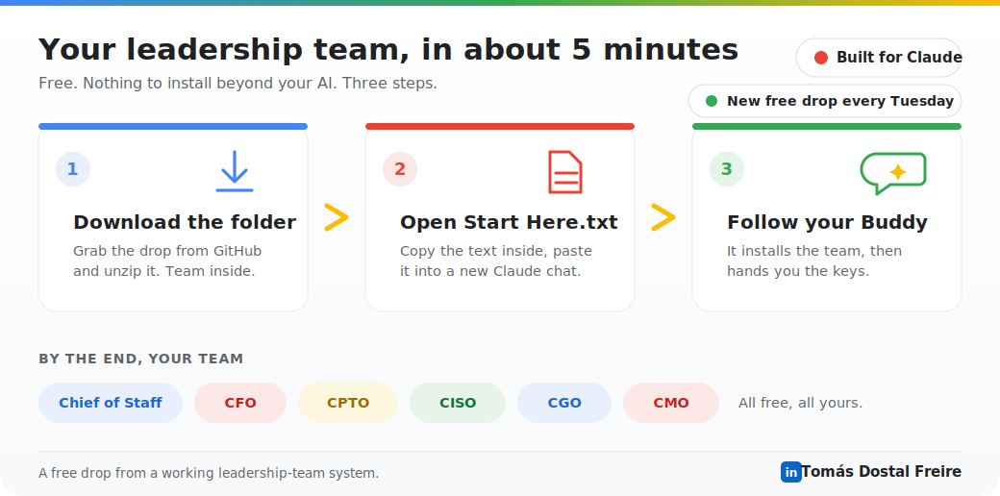
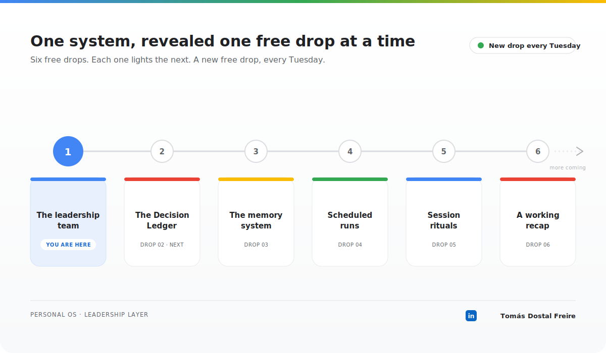

# the-human-ai-os

A free leadership team for your own AI, released one piece at a time, no
paywall, no email required. **Built for Claude.**

## Get started in about 5 minutes

1. **Download the drop.** Grab [`drop-01-leadership-team.zip`](https://github.com/tomdosfre/the-human-ai-os/releases/download/drop-01/drop-01-leadership-team.zip)
   from the [latest Release](https://github.com/tomdosfre/the-human-ai-os/releases/latest)
   and unzip it, you get the whole folder: your leadership team plus a
   `_Start Here.txt`.
2. **Open `_Start Here.txt`.** Copy the text inside it, paste it into a new chat
   in Claude ([claude.ai](https://claude.ai) or the Claude app), and send.
3. **Follow your Onboarding Buddy.** It shows you the team, installs the files
   into a Claude Project so they stick, then hands you the keys.

That's it: no account beyond your AI, no install tools, no API key, nothing
leaves your chat.

> On a different AI (ChatGPT, Gemini, something else)? This drop is built for
> Claude: reach out via the link below and I'll help you find the closest setup.

## Roadmap

The drops arrive one at a time. Drop 1 (the leadership team) is live.
Next up: Drop 2, the Decision Ledger. After that: the memory system,
scheduled runs, session rituals, and a final recap.

---
Repo: https://github.com/tomdosfre/the-human-ai-os · Follow along: https://www.linkedin.com/in/tomasdostalfreire/
